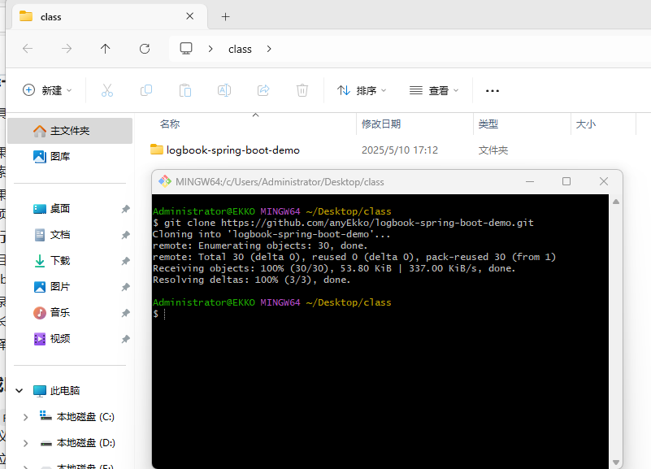
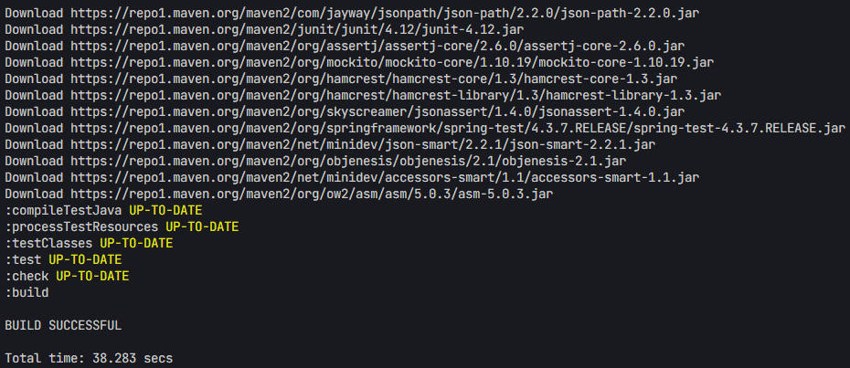
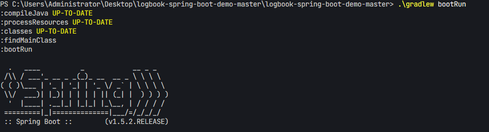
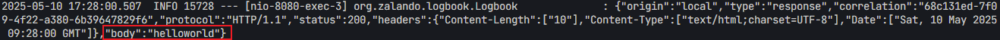

<!-- by 朱淼佳 -->

## 2. Feature Overview  


<!-- by 朱淼佳 -->

## 2. Feature Overview  


This project provides the following core functionalities:  

### 2.1 HTTP Request & Response Logging  
**Based on Spring AOP:**  
- Create an interceptor to capture all HTTP requests and responses.  
- Log request paths, methods, parameters, and response data within the interceptor.  
- **Advantage:** Decouples business logic from logging logic, enabling flexible logging.  

**Using Spring’s `HandlerInterceptor`:**  
- Implement the `HandlerInterceptor` interface and log requests/responses in `preHandle` and `postHandle`.  
- **Advantage:** Provides a more direct way to intercept and process HTTP requests.  

**Using Third-Party Libraries (e.g., Logbook):**  
- Integrate Logbook to automatically log HTTP request/response data.  
- Simple configuration with support for various extensions.  

### 2.2 Support for Multiple Log Formats  
**Based on Logging Frameworks (e.g., Logback or Log4j):**  
- Configure formats via `logback.xml` (Logback) or YAML/JSON (Log4j) to define different log output templates.  
- **Advantage:** Easy to use, supports multiple output formats.  

**Using Log Adapters/Converters:**  
- Implement a log adapter to convert log content into different formats (e.g., JSON, XML, or custom formats).  
- **Advantage:** Highly flexible, allowing customized output.  

**Multi-Format Log Appender:**  
- Create a custom log appender that dynamically selects log formats (e.g., JSON, plain text) based on configuration.  
- **Advantage:** Supports multiple log formats within the same system.

## 2.3 Flexible Log Filtering

- **Regular Expression-based Filtering:**
  - Use regular expressions to match URLs, request parameters, or response content for dynamic log filtering.
  - **Advantages:** More precise filtering rules, suitable for complex scenarios.

- **Dynamic Rule Engine:**
  - Integrate a rule engine (such as Drools or EasyRules) to define filtering conditions via rule files or dynamic loading.
  - **Advantages:** Supports more complex logic and combinations of conditions.

- **Distributed Filtering Rules:**
  - In distributed systems, centrally manage log filtering rules and synchronize them to all service instances.
  - **Advantages:** Unified rules, easier to maintain.

## 2.4 Dynamic Configuration Adjustment

- **Configuration Center Support:**
  - Integrate with a configuration center (such as Spring Cloud Config, Apollo, or Nacos) to dynamically load log-related configurations.
  - **Advantages:** Centralized management, supports real-time updates.

- **Database-based Configuration Updates:**
  - Store log configurations in a database and modify them in real-time through a management interface.
  - **Advantages:** Easy to operate, suitable for operations teams.

- **Hot Update Mechanism:**
  - Utilize Spring Boot’s `@ConfigurationProperties` and hot-reloading mechanism to monitor changes in configuration files and apply them in real-time.
  - **Advantages:** Simple implementation, suitable for small projects.

## 2.5 Performance Optimization

- **Batch Log Writing:**
  - Temporarily store log data in an in-memory queue and periodically write it in batches to disk or external storage.
  - **Advantages:** Reduces I/O operations, improves write efficiency.

- **Log Compression Storage:**
  - Compress log data using algorithms like GZIP when writing to log files.
  - **Advantages:** Saves storage space, suitable for large-scale log data.

## 2.6 High Extensibility

- **Support for Multiple Storage Targets:**
  - Provide interfaces to write logs to files, databases, message queues (such as Kafka, RabbitMQ), or cloud storage.
  - **Advantages:** Adapts to different storage needs.

- **Log Flow Based on Message Middleware:**
  - Send log data as messages to middleware (such as Kafka) for processing by independent services for log storage or analysis.

  - **Advantages:** Supports high-concurrency log processing.

<!-- by 莫永启 -->
## 3. Environmental requirements
To run this project, the following environmental requirements must be met:

### 3.1 Operating System
- Supports Windows, macOS, and major Linux distributions.

### 3.2 Java Runtime Environment
- It is recommended to use JDK 11 or higher.
- You can check if the JDK is installed correctly by using the following command:```bashjava -version```

### 3.3 Build Tool
- This project uses Gradle for building, and Gradle version 3.3 or higher must be installed.
- Check the Gradle version:```bashgradle -v```

### 3.4 Network Environment
- A stable internet connection is required to download dependencies and run services.
- Domestic users may need to use VPNs or other network tools due to GitHub's services located overseas.
- When running the project:```bashgradlew runDownloading https://services.gradle.org/distributions/gradle-3.3-bin.zip requires an internet connection.```---
  
<!-- by 唐文广 -->
## 4. Quick Start
Warm reminder: You need to complete the environment configuration in order to deploy this project. This project requires JDK version 1.8 or higher and Gradle version 3.3 or higher.
Follow the steps below to quickly start this project:

### 4.1 Clone the Code
First, clone the project code to your local environment:
```bash
git clone https://github.com/anyEkko/logbook-spring-boot-demo.git
```


### 4.2 Build the Project
Use Gradle to build the project:
```bash
gradlew build
```
The successful build result is shown below:


### 4.3 Start the Service
Run the following command to start the Spring Boot service:
```bash
gradlew bootRun
```
After the service starts successfully, it will look like this:


### 4.4 Access the Service
After the project is started, it listens by default at http://localhost:8080. You can access and test it via a browser or tools like Postman.
You can access http://localhost:8080/echo/ + any test case you want.
For example: access http://localhost:8080/echo/helloworld.
You will see the text "helloworld" on the webpage.
  

You can also clearly see the sample information in the backend:

---

<!-- by 伍师杰 -->
### 5. 
Project ArchitectureThis project adopts a modular architecture design, following the principles of high cohesion and low coupling to ensure the system's maintainability and scalability. The architecture is mainly divided into the following core modules:

### 5.1
Logging ModuleImplementation: 

Full link interception and logging of HTTP requests/responses based on the Logbook framework.Core Functions:
- Support for multiple log format configurations such as JSON and text.
- Provide refined filtering rules for request/response content.
- Support asynchronous log writing to avoid blocking the main business process.
- Extendable log output channels (files, ELK, databases, etc.).

### 5.2 
Configuration ModuleImplementation: 

Based on the Spring Boot configuration system, combined with Nacos for dynamic configuration.Core Functions:
- Centrally manage application configurations via application.yml.
- Support multi-environment configuration isolation (dev/test/prod).
- Implement hot configuration update mechanism, with key parameter modifications taking effect in real-time.
- Provide configuration version management and rollback capabilities.

### 5.3 Security ModuleImplementation: 
Based on custom filters and annotations for sensitive data processing.Core Functions:
- Automatically identify and mask sensitive information such as ID numbers and phone numbers.- Support custom desensitization rules with regular expressions.
- Provide logging audit and tracking capabilities.
- Comply with data security regulations such as GDPR.

### 5.4 Controller ModuleImplementation: 
Spring MVC RESTful style API design.Core Functions:
- Clear API version management (/v1/api/...).
- Unified exception handling mechanism.- Complete Swagger API documentation.
- Automatic validation of request parameters (JSR-303).Module Interaction Design:
- Each module interacts through clearly defined interface contracts: 
- Achieve module decoupling through Dependency Injection (DI).
- Set circuit breaker downgrade mechanisms at critical interaction points.  
- Use DTO objects for communication between modules.
- Implement asynchronous event notification through Spring Event.This architecture design supports horizontal scaling. Subsequent enhancements can be achieved through:
- Introducing a modular loading mechanism (OSGi).
- Adding gRPC internal communication protocols.
- Supporting plugin-based functionality extensions.
  - **Advantages:** Supports high-concurrency log processing.
  
<!-- by 陆发欣 -->
## 6.Configuration Description
### 6.1 Code highlighting
Visual software will highlight different keywords, values, etc. according to the syntax characteristics of YAML files. For example, "logbook", "format", "filters", etc. will be identified as keys and displayed in a specific colour, while "json", "/api/secure/*", "true", "info" and other values will be presented in another colour, which can make me We can more intuitively divide the configuration items and their corresponding values, which is easy to understand and modify.
### 6.2 intellisense
During the writing process, the Visual software will provide intelligent prompts. For example, when we enter "logbook:" and press the Enter key, the software may automatically prompt our common sub-configuration items, such as "format", "filters", etc., to help us complete the code writing quickly and accurately, and reduce the lead due to spelling errors or forgetting configuration items. To the error.
### Code Display
```logbook:
  format: json            # Log output format: json or text
  filters:
    pattern: /api/secure/*  # Filter rule: match path
    mask: true              # Mask sensitive information for matches
  log-level: info          # Log level
```
### 6.3 Structured View
Visual software usually provides a structured view panel where we can clearly see the overall structure of YAML files. For example, it can be seen that "server" and "spring" are configuration items of the same level, while "port" is a sub-item of "server", "application" is a sub-item of "spring", and "name" is " Application" sub-items, etc. This structured view can help us quickly locate a specific configuration part, which is convenient for modification and viewing.
### 6.4 Code Folding and Unfolding
Code folding and expansion: For YAML configurations with multi-level nesting, Visual software supports code folding and expansion functions. For example, we can fold the "spring" configuration item and its sub-items to display only the top-level key "spring". When we need to view or modify the "application" and "name" inside, we can expand the corresponding part. This can effectively reduce visual interference and improve the readability and maintainability of the code when processing complex YAML files.
### Code Display
```server:
  port: 8080               # Service listening port
spring:
  application:
    name: logbook-demo     # Application name
```
### 6.5 Log Configuration
• logbook: the root node of the log configuration, including all log-related settings.
• format: Set the log output format to JSON, which is convenient for program analysis and integration with other systems.
• filters: define filter rules, including path matching and sensitive information shielding.
• pattern: The matching path is /api/secure/*, which means that all paths starting with /api/secure/ will be filtered.
• mask: set to true to shield the sensitive information in the matching path.
• log-level: Set the log level to info, and record log information above the info level.
### Code Display
```logbook:
  format: json            # Log output format: json or text
  filters:
    pattern: /api/secure/*  # Filter rule: match path
    mask: true              # Mask sensitive information for matches
  log-level: info          # Log level
```
### 6.6 Service and application configuration
• server: service monitoring configuration.
• port: Set the service listening port to 8080, which is used to receive client requests.
• spring: Spring framework-related configuration.
• application: application configuration.
• name: Set the application name to logbook-demo, which is used to identify and manage applications in the Spring ecosystem.
Advantages of using Visual software
When writing and managing YAML files in Visual software (such as Visual Studio Code), you can make full use of the following functions:
1. Code highlighting: Different configuration items and values are displayed in different colours for easy distinction and understanding.
2. Intelligent Tips: Automatically prompt common configuration items and values to reduce manual input errors.
3. Structured view: provides an overview of the file structure, which is convenient to quickly locate specific configuration items.
4. Code folding: supports folding and expanding nested configurations to improve code readability.
Through these functions, the writing and maintenance of YAML configuration files can be completed efficiently and accurately to ensure that the configuration meets business needs.
### Code Display
```server:
  port: 8080               # Service listening port
spring:
  application:
    name: logbook-demo     # Application name
```

